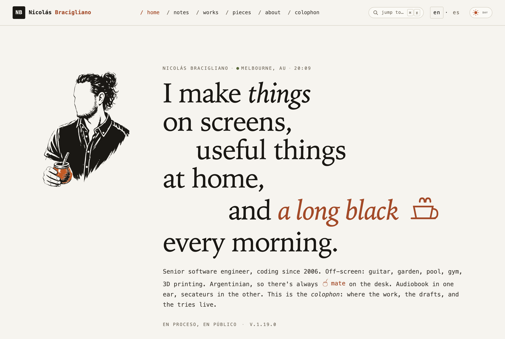
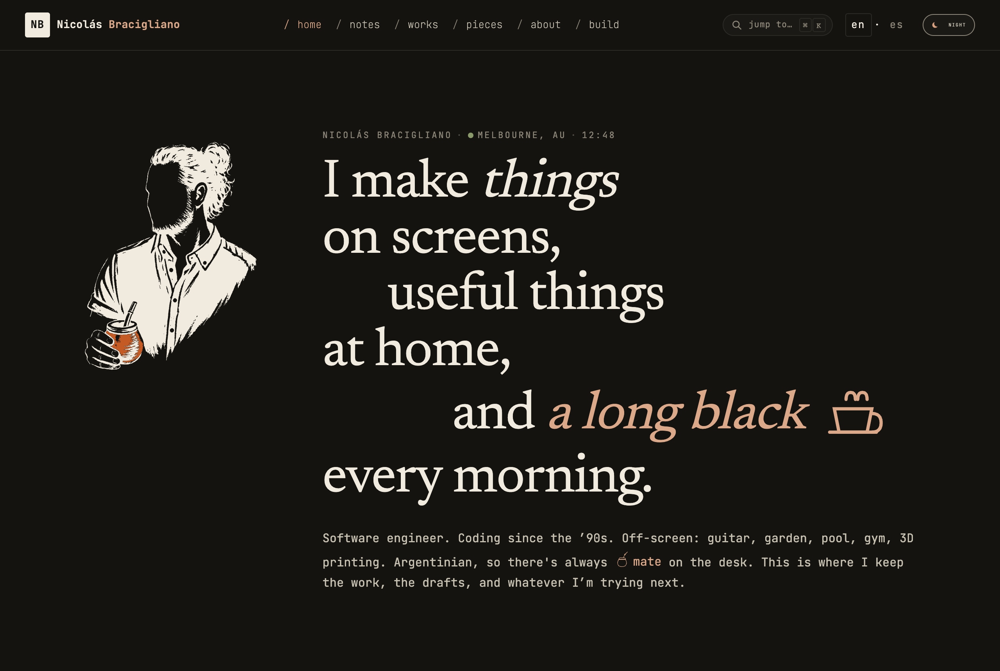

# nicolasbracigliano.com

[](https://github.com/nicolas-bracigliano/nicolasbracigliano/actions/workflows/ci.yml)

A bilingual personal site by Nicolás Bracigliano: a colophon, not a portfolio. Built as a small reference for taste in typography, architecture, and engineering.

→ Live at **[nicolasbracigliano.com](https://nicolasbracigliano.com)** · en/es with full hreflang.

<p align="center">
  
  
</p>

The codebase is the colophon. Every consequential choice (the strict `script-src 'self'` under native View Transitions, the mirrored bilingual routes, the per-route visual treatments) is documented in [`docs/decisions/`](./docs/decisions/). Read those if you came for the architecture; jump to [**Local development**](#local-development) if you came to run it.

---

## What's interesting about it

- **Strict CSP under View Transitions.** `default-src 'self'; script-src 'self'; style-src 'self' 'unsafe-inline'` over Astro's `<ClientRouter />`. The combination is non-obvious: ClientRouter injects runtime view-transition styles that can't be hashed at build time, and every hoisted `<script>` has to externalize for `script-src 'self'` to hold. See [ADR 0002](./docs/decisions/0002-csp-style-src-unsafe-inline.md) for the style-src trade-off and [ADR 0008](./docs/decisions/0008-externalize-hoisted-scripts-for-csp.md) for the script-side fix. CI enforces the contract: every route is asserted to ship zero inline `<script>` bodies on every PR.

- **Cloudflare Workers Static Assets, one tiny Worker.** [`src/worker.ts`](./src/worker.ts) handles two dynamic paths — an `Accept-Language` redirect at `/` and `/.well-known/security.txt` — and delegates everything else to the asset binding. `run_worker_first = true` in [`wrangler.toml`](./wrangler.toml) keeps the redirect alive past Cloudflare's `not_found_handling = "404-page"` short-circuit (a real bug the test suite now catches; the [ADR 0001 postscript](./docs/decisions/0001-cloudflare-pages.md) tells the migration story).

- **Bilingual mirrored routes.** Every page exists at `/en/<slug>` and `/es/<slug>` with localised URL segments (`/en/notes/` ↔ `/es/notas/`, `/en/works/` ↔ `/es/obras/`, `/en/colophon/` ↔ `/es/colofón/`). [`src/lib/routes.ts`](./src/lib/routes.ts) is the single source of truth, [ADR 0003](./docs/decisions/0003-mirrored-bilingual-routes.md) is the rationale, and the post-deploy CI smoke script ([`scripts/smoke-routes.ts`](./scripts/smoke-routes.ts)) derives its route list from `ROUTES` + published content frontmatter at runtime. Adding a route is one edit, not two.

- **TypeScript strict, the real flags.** All four "the ones that actually catch bugs" flags are on: `exactOptionalPropertyTypes`, `noUnusedLocals`, `noUnusedParameters`, `noImplicitReturns`. [ADR 0007](./docs/decisions/0007-tsconfig-strictness-flipped.md) documents the post-bootstrap flip.

- **ADRs as load-bearing documentation.** One file per consequential trade-off, with `Context / Decision / Alternatives / Consequences / When to revisit` sections and post-decision amendments when reality moves. [Index here](./docs/decisions/). Each ADR is meant to answer "why was this decided?" two years later, the test is whether a stranger reading the codebase cold can reconstruct the original constraint set.

- **Performance budgets that bite.** Lighthouse perf/a11y/best-practices/SEO all ≥ 0.95, plus resource caps in [`lighthouserc.json`](./lighthouserc.json): script ≤ 15 KB, document ≤ 27 KB, and a ~135 KB total (≈79 KB of which is the two self-hosted variable fonts, immutable-cached after first load). CI fails on regression.

- **A11y on every PR.** `@axe-core/playwright` runs against every route in the e2e suite. Serious or critical violations fail the build, not a manual sweep.

- **No analytics.** No beacon, no cookies, no third-party requests; the CSP's `connect-src 'self'` forecloses client-side tracking by default.

---

## Stack

- **Framework:** Astro 7 (`output: 'static'`, no SSR adapter)
- **Runtime:** Node 24 LTS, pnpm 11 via Corepack
- **Content:** Markdown in repo, typed via Zod content collections
- **Hosting:** Cloudflare Workers Static Assets, served from [`src/worker.ts`](./src/worker.ts) + [`wrangler.toml`](./wrangler.toml)
- **Type:** Newsreader (variable, display) · JetBrains Mono (variable, body/mono)
- **CI:** GitHub Actions, every `uses:` ref pinned to a 40-char SHA; Renovate manages version drift

---

## Design notes

The site treats each route as its own short essay with its own visual register. The per-route metaphors are the design spine:

- `/`: **Workshop bench**. A literal bench of "currently on the bench" cards drawn from the active `/now` items (code, guitar, 3D print, coffee, …), animated once on scroll-into-view per [DS §15: animate into existence, then rest](./docs/design-system.md).
- `/notes/`: **Marginalia notebook**. Three-column grid with date/tags rail · prose · sticky tilted margin-note. Ornament `<hr>` between paragraphs.
- `/works/`: **Index-card catalog**. Vignette + `<dl>` of specs + status dot. Filter buttons gated to ~600 B of vanilla JS.
- `/about/`: **Editorial + sidebar**. Two-column prose with sticky FactsCards. A first-visit `hola.` intro overlay that dissolves with `filter: blur()`.
- `/about/now/`: **Numbered bench tour**. What's on my bench right now.
- `/colophon/`: **Typewriter credits roll**. Tags + `<dl>` rows, ASCII signature.
- `/404`: **Misplaced letter**. Bilingual recovery affordance.

Animation discipline lives in [ADR 0006](./docs/decisions/0006-no-first-paint-animation.md) (no first-paint animation; axe-core would mid-fade-fail contrast checks otherwise) and [ADR 0005](./docs/decisions/0005-theme-state-auto-override-retire.md) (the Día/Noche theme state machine that retires explicit overrides when the OS catches up).

---

## Reading the code

The repo at a glance:

```
src/
  pages/        # 21 routes, mirrored /en/* and /es/* via Astro file routing
  layouts/      # BaseLayout (head, chrome, hreflang) + per-collection layouts
  components/   # 45 .astro components: vignettes, cards, ⌘K palette, chrome
  content/      # notes · pieces · works · pages, typed by content.config.ts
  lib/          # routes.ts (route source of truth), i18n, content helpers
  styles/       # tokens + base + per-route CSS in src/styles/routes/
  worker.ts     # dynamic edge: Accept-Language redirect at / + security.txt
docs/           # design-system · architecture · security · ci · decisions/ (ADRs)
```

| Doc                                                | When to read                                                                                                            |
| -------------------------------------------------- | ----------------------------------------------------------------------------------------------------------------------- |
| [`docs/design-system.md`](./docs/design-system.md) | Canonical visual + a11y spec. Read before changing colour, copy, layout, or adding a route.                             |
| [`docs/architecture.md`](./docs/architecture.md)   | Layer map, dependency rule, where to put new code.                                                                      |
| [`docs/security.md`](./docs/security.md)           | Commit signing, DNSSEC, host-neutral header directives, automation workflows, Cloudflare lock-in surface + escape plan. |
| [`docs/ci.md`](./docs/ci.md)                       | What each CI job does, when it's required-vs-informational.                                                             |
| [`docs/decisions/`](./docs/decisions/)             | ADRs. One file per consequential trade-off. Start here when you need to know _why_.                                     |

---

## Local development

```bash
nvm use 24        # repo pins Node 24 (fnm / asdf work too)
corepack enable
pnpm install

pnpm dev          # astro dev on :4321
pnpm dev:fn       # astro build + wrangler dev; exercises the / redirect via the real Worker runtime
pnpm new          # interactive scaffold for a new note / piece / work / now-item (see Authoring content)
pnpm verify:fast  # typecheck + lint + workflow-pin lint + format:check + vitest
pnpm verify:slow  # build + html-validate + playwright + lhci
pnpm verify       # both
```

`pnpm verify` runs the same gates as CI. If it's green locally, every required CI check will pass.

### Authoring content

`pnpm new` prompts you through the four bilingual content shapes: `note`, `piece` (ensayo), `work` (obra), and replacing one of the `now`-page items. It writes both EN + ES files with `status: draft` and a `_Draft._` placeholder body; the writer fills in the real content and flips `status:` when ready. The scaffold reuses the same enums and schemas as the build, so a scaffolded entry passes `astro check` on first save. See [`docs/design-system.md`](./docs/design-system.md) §7 (notes) and §7a (pieces) for the writing recipes; [ADR 0013](./docs/decisions/0013-per-entry-art.md) for the per-entry `hero:` art contract.

### Drafts

`getStaticPaths` filters on `status: 'published'`, so drafts are invisible locally too. To preview, flip the frontmatter in a working copy and run `pnpm dev`. Don't commit the flip.

### Fonts

```bash
pnpm subset-fonts
```

One-shot local task. Downloads and subsets the variable Newsreader + JetBrains Mono into `public/fonts/`. CI does not subset. Commit the resulting files.

---

## What runs automatically

- **CI** ([`.github/workflows/ci.yml`](./.github/workflows/ci.yml)): every push + PR. Build → Lighthouse + Playwright in parallel → Cloudflare deploy gated on all of the above. Path-filter skips the heavy jobs on docs-only changes; `vars.LHCI_FORCE` / `vars.E2E_FORCE` are the override.
- **Security** ([`.github/workflows/security.yml`](./.github/workflows/security.yml)): daily 22:00 UTC. `pnpm audit`, license allow-list, gitleaks, CodeQL static analysis, security.txt expiry guard.
- **security.txt rotate** ([`.github/workflows/security-txt-rotate.yml`](./.github/workflows/security-txt-rotate.yml)): monthly on the 1st. Opens a renewal PR when `Expires` is < 60 days from lapsing.
- **release-please** ([`.github/workflows/release-please.yml`](./.github/workflows/release-please.yml)): every push to `main`. Maintains a release PR with `CHANGELOG.md` + `package.json` version bump; merging cuts a GitHub Release.
- **Renovate** (Mend GitHub App; [`renovate.json`](./renovate.json)): Monday mornings, Australia/Melbourne. Auto-merges patch/minor/digest/lockfile/vulnerability updates after CI passes; majors gated for human review.

All `uses:` references in workflow YAML are pinned to immutable 40-char SHAs with the version in a trailing comment. Renovate's `pinGitHubActionDigests` preset keeps them fresh.

---

## License

- **Code:** MIT. See [`LICENSE`](./LICENSE).
- **Content** (markdown, images, OG cards): CC BY-NC-SA 4.0. See [`CONTENT-LICENSE`](./CONTENT-LICENSE).

The split is intentional: the code is reference material for anyone who wants to learn from or fork it; the writing and images are mine.

This is a personal site, not a community project: fork the code freely, but I'm not taking feature PRs. Issues are welcome for factual errors, broken links, or accessibility bugs.
